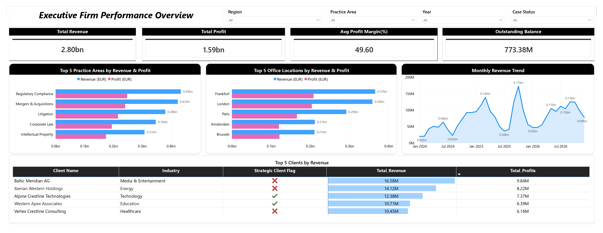
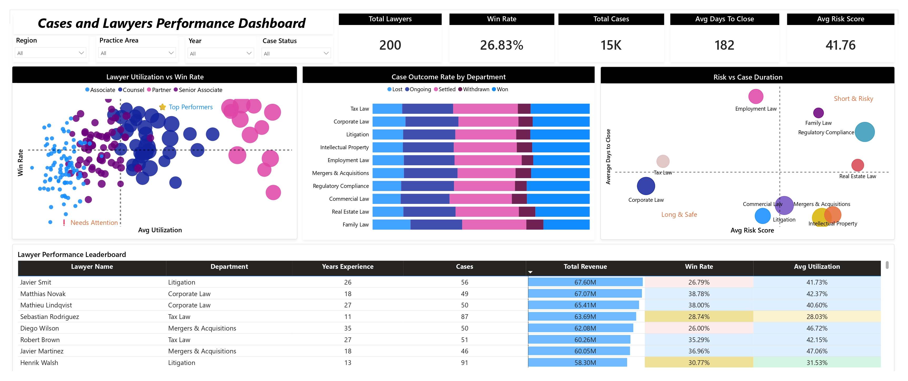
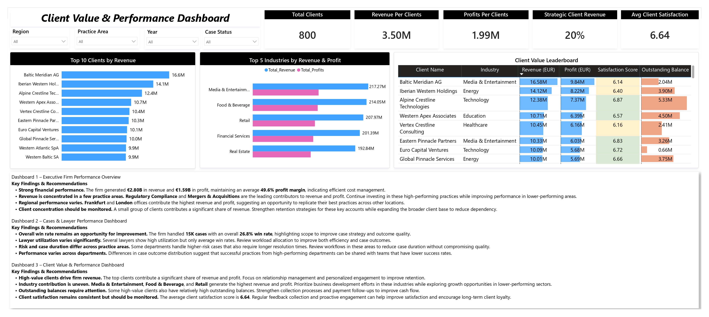

# ⚖️ Legal Case Performance Analytics Dashboard

> **FP20 Analytics ZoomCharts Challenge #39**

An interactive **Power BI dashboard** developed for the **FP20 Analytics ZoomCharts Challenge #39** to analyze legal operations, firm performance, lawyer productivity, case outcomes, and client value. The dashboard enables law firm partners and management teams to make data-driven decisions by providing actionable insights into profitability, resource allocation, and client relationships.

---

# 📌 Project Overview

Legal firms manage thousands of cases across multiple practice areas, offices, lawyers, and clients. Tracking financial performance while ensuring efficient resource utilization and high client satisfaction can be challenging.

This dashboard transforms raw legal operations data into executive-level insights by analyzing:

- Firm financial performance
- Lawyer productivity and utilization
- Case outcomes and risk
- Client profitability
- Industry contribution
- Outstanding balances
- Client satisfaction

The report is designed to support strategic decision-making through interactive visualizations and business-focused storytelling.

---

# 🎯 Business Objectives

This dashboard answers key business questions such as:

- Which practice areas generate the highest revenue and profit?
- Which office locations contribute the most to firm performance?
- How do case outcomes vary across departments?
- Which lawyers have the highest utilization and win rates?
- How do case duration and risk impact legal operations?
- Which clients and industries generate the highest business value?
- Which clients require attention due to outstanding balances?

---

# 📊 Dashboard Overview

## 📄 Page 1 – Executive Firm Performance Overview

### Key Metrics

- Total Revenue
- Total Profit
- Average Profit Margin
- Outstanding Balance

### Visuals

- Top 5 Practice Areas by Revenue & Profit
- Top 5 Office Locations by Revenue & Profit
- Monthly Revenue Trend
- Top 5 Clients by Revenue

### Business Value

Provides an executive overview of the firm's financial health and identifies the strongest-performing practice areas, offices, and clients.

---

## 📄 Page 2 – Cases & Lawyer Performance Dashboard

### Key Metrics

- Total Lawyers
- Total Cases
- Win Rate
- Average Days to Close
- Average Risk Score

### Visuals

- Lawyer Utilization vs Win Rate
- Case Outcome Distribution by Practice Area
- Risk vs Case Duration by Practice Area
- Lawyer Performance Leaderboard

### Business Value

Helps management optimize lawyer workload, monitor utilization, identify high-risk practice areas, and improve case outcomes.

---

## 📄 Page 3 – Client Value & Performance Dashboard

### Key Metrics

- Total Clients
- Revenue per Client
- Profit per Client
- Strategic Client Revenue
- Average Client Satisfaction

### Visuals

- Top 10 Clients by Revenue
- Top 5 Industries by Revenue & Profit
- Client Value Leaderboard

### Business Value

Supports client relationship management by identifying high-value clients, profitable industries, client satisfaction levels, and outstanding balances.

---

# 📈 Key Insights

### Executive Performance

- The firm generated **€2.80B** in total revenue with **€1.59B** in profit.
- Average profit margin remained close to **50%**, indicating strong operational efficiency.
- Regulatory Compliance and Mergers & Acquisitions are among the top-performing practice areas.
- Frankfurt and London offices contribute significantly to overall revenue.

### Lawyer & Case Performance

- The firm handled approximately **15K legal cases** through **200 lawyers**.
- Lawyer utilization varies across teams, highlighting opportunities for better workload balancing.
- Case outcome distribution differs across practice areas, indicating opportunities to share best practices.
- High-risk cases generally require longer resolution times and should be monitored closely.

### Client Performance

- A relatively small number of clients contribute a significant share of revenue.
- Media & Entertainment, Food & Beverage, and Retail are among the highest revenue-generating industries.
- Some high-value clients also carry higher outstanding balances, requiring proactive follow-up.
- Average client satisfaction remains stable, with opportunities to further improve long-term client retention.

---

# 💡 Recommendations

- Invest further in high-performing practice areas while improving lower-performing ones.
- Optimize lawyer workload to improve utilization and overall win rates.
- Streamline processes for high-risk and long-duration cases.
- Strengthen relationships with high-value clients through targeted engagement.
- Improve collections for clients with significant outstanding balances.
- Expand business development efforts within high-performing industries.

---

# 🛠️ Tools & Technologies

- Microsoft Power BI
- Power Query
- DAX
- Data Modeling
- ZoomCharts Custom Visuals
- Data Visualization
- Business Intelligence

---

# 📷 Dashboard Preview

## 📊 Executive Firm Performance Overview

---

## ⚖️ Cases & Lawyer Performance Dashboard

---
## 👥 Client Value & Performance Dashboard

---

# 🚀 Skills Demonstrated

- Business Intelligence
- Dashboard Design
- Data Storytelling
- Data Modeling
- DAX
- KPI Design
- Interactive Reporting
- Executive Reporting
- Legal Analytics
- Performance Analysis

---

# 🙏 Acknowledgements

This project was created as part of the **FP20 Analytics ZoomCharts Challenge #39**.

Special thanks to the **FP20 Analytics** community and **ZoomCharts** for providing the dataset and challenge scenario.

---

## 👨‍💻 Author

**Mohan Kumar**

⭐ If you found this project helpful, consider giving this repository a star!
